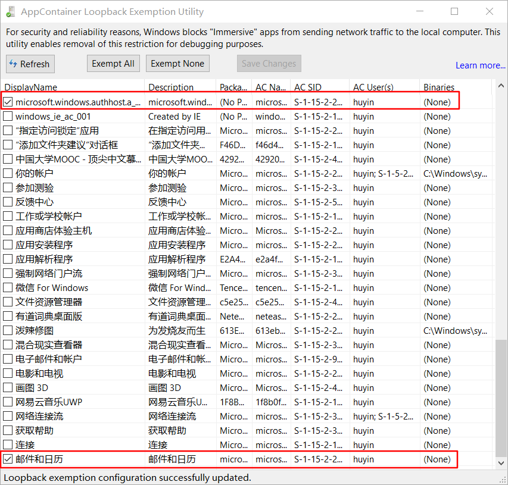

由于Windows10里的UWP使用了一种叫Container的技术，使得网络代理软件的设置无法影响到UWP应用，本文讲述了突破这种限制，但对部分UWP(Facebook,Instgram等)应用无效。
 <!-- more --> 

#### 安装 Fiddler 或 Windows Loopback Exemption Manager
* Fiddler是一款telerik旗下的免费软件，在[官网](https://www.telerik.com/fiddler)直接下载即可，Fiddler是一款强大的Http调试代理工具。
当启动Fiddler，程序将会把自己作为一个代理，所有的http请求在达到目标服务器之前都会经过fiddler，同样的，所有的http响应都会在返回客户端之前流经Fiddler。
Fiddler也是一种抓包工具（类似的还有Wireshark）。
* [Windows Loopback Exemption Manager](http://loopback.codeplex.com/)与Fiddler相比则更加轻量。

本文使用Fiddler作为示例

#### 配置Fiddler
打开Fiddler，点击左上角WinConfig图标。勾选如下两项即可Windows10的邮件APP走网络代理。
<!--  -->


#### 添加Gmail账号
打开`邮件`➡左下角`设置图标`➡`管理账户`➡`添加账户`

#### 参考资料
* [知乎问题：win10的邮件怎么添加并同步gmail？](https://www.zhihu.com/question/53079836)
* [Revisiting Fiddler and Win8+ Immersive applications
](https://blogs.msdn.microsoft.com/fiddler/2011/12/10/revisiting-fiddler-and-win8-immersive-applications/?cm_mc_uid=63183556597015043225550&cm_mc_sid_50200000=1504322555)
